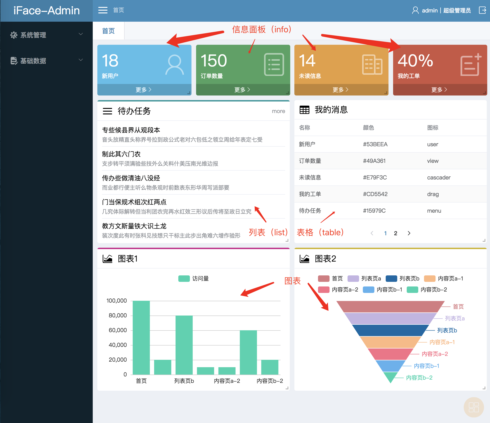

## 仪表的类型

下图包含了几种常见的仪表类型



## 仪表盘的配置

要在首页配置仪表盘，需要先在系统里面增加可选的仪表，系统提供提个仪表管理的页面。

仪表包含的属性和说明：

```javascript
// Dashboard 对象
{
  id: number, // 仪表id
  name: string, // 仪表名称，会显示在仪表的标题栏位置
  type: string, // 仪表类型，会根据仪表类型显示不同的仪表组件
  url: string, // 仪表数据源URL，显示仪表的时候，数据将请求这个接口获取
  color: string, // 仪表颜色，信息面板类型的仪表，会作为背景色，其他类型的仪表，会做为强调色
}
```

## 仪表接口数据

每个仪表的数据都是通过仪表配置的URL为接口地址获取的，不同类型的仪表，需要返回不同的数据接口\(遵循iFace接口规范\)

* 信息面板（info）

  ```javascript
  data: {
    title: string, // 主要信息文字
    link?: string,  // ‘更多’的链接地址
  }
  ```

* 列表（list）

  ```javascript
  data: {
    rows: [{
      title: string, // 主要文本
      subTitle?: string, // 次要文本
      url?: string, // 链接地址
    }],
    link?: string, // ‘更多’的链接地址
  }
  ```

* 表格（table）表格的数据格式详情见[ 组件-表格](/components/table.md)

  ```javascript
  data: {
    columns: any[] // 列配置
    rows: any[],   // 行数据
    total: number, // 总条数
  }
  ```

* 图表，支持v-charts的所有图表，数据格式见[v-charts文档](https://v-charts.js.org)