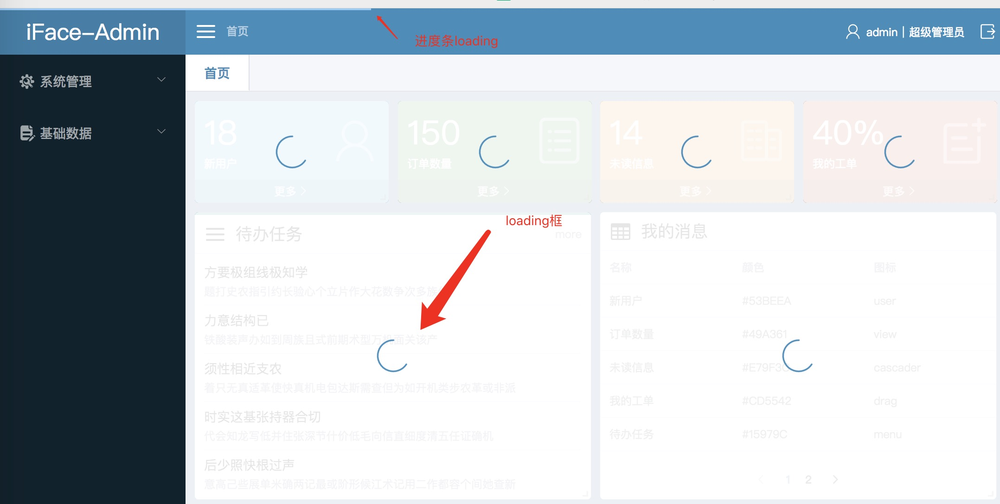

## 显示形式

iFace的laoging有2中显示形态，一种是全局的loading条，这种loading会在页面顶部显示一个进度条，用于提示用户接口正在请求。还有一种是elementUI提供的loading，主要会在指定位置显示一个转动的loading层，用来提示用户数据正在加载。2种loading的使用方法和场景不一样

* 进度条loading是每个接口请求的时候都会显示的，这个是系统默认的效果，不需要手动配置
* loading框在需要的地方手动显示和隐藏。
* 进度条loading的颜色可以在文件[regComponents.ts](https://github.com/ccqiuqiu/iface/blob/7489643b579a46af24aa17b69649551e1f9e6734/src/global/regComponents.ts)配置
* ```text
      Vue.use(VueProgressBar, {
        color: '#93ccf8', // 进度条颜色
        failedColor: '#F56C6C', // 出错后的颜色
      })
  ```

